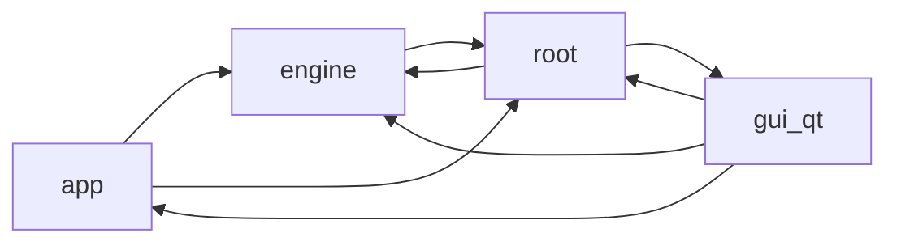

# Codebase audit overview

The generated findings below were manually triaged in the curated [audit findings review](../findings-review.md). Keep verdicts and remediation notes in the curated review; this generated block is replaced on audit refresh.

<!-- audit:generated:start overview -->
## Architecture

## Analyzer status

| Analyzer | Status | Detail |
|---|---|---|
| ruff | available | - |
| vulture | available | - |
| radon | available | - |
| deps | available | - |
| contracts | available | - |

## Headline metrics

| Metric | Value |
|---|---|
| Modules | 176 |
| Total LOC | 38404 |
| Statement coverage | 44.6% |
| Module-average coverage | 52.6% |
| Import cycles | 2 |
| Modules over complexity threshold | 62 |
| Dead symbols (high confidence) | 0 |

## Coverage provenance

| Status | Source | Input digest | Detail |
|---|---|---|---|
| matched | coverage.py | 865eeaaace16 | - |

## Least-covered modules

| Module | Statements | Covered | Coverage |
|---|---:|---:|---:|
| `plex_renamer/__main__.py` | 18 | 0 | 0.0% |
| `plex_renamer/engine/_core.py` | 9 | 0 | 0.0% |
| `plex_renamer/gui_qt/_main_window_bootstrap.py` | 38 | 0 | 0.0% |
| `plex_renamer/gui_qt/_main_window_bridges.py` | 79 | 0 | 0.0% |
| `plex_renamer/gui_qt/_main_window_chrome.py` | 76 | 0 | 0.0% |
| `plex_renamer/gui_qt/_main_window_feedback.py` | 159 | 0 | 0.0% |
| `plex_renamer/gui_qt/_main_window_scan.py` | 112 | 0 | 0.0% |
| `plex_renamer/gui_qt/_main_window_shell.py` | 40 | 0 | 0.0% |
| `plex_renamer/gui_qt/_main_window_shortcuts.py` | 58 | 0 | 0.0% |
| `plex_renamer/gui_qt/_main_window_state.py` | 121 | 0 | 0.0% |

## Largest modules

| Module | LOC |
|---|---|
| `plex_renamer/engine/_episode_resolution.py` | 1938 |
| `plex_renamer/engine/_batch_orchestrators.py` | 1037 |
| `plex_renamer/gui_qt/widgets/_episode_table_model.py` | 911 |
| `plex_renamer/job_executor.py` | 907 |
| `plex_renamer/gui_qt/widgets/_work_panel.py` | 852 |
| `plex_renamer/gui_qt/widgets/_bulk_assign_panel.py` | 760 |
| `plex_renamer/engine/_tv_scanner_consolidated.py` | 685 |
| `plex_renamer/gui_qt/widgets/_episode_table_delegate.py` | 665 |
| `plex_renamer/job_store.py` | 621 |
| `plex_renamer/gui_qt/widgets/job_detail_panel.py` | 618 |

## Most complex

| Module | Max CC |
|---|---|
| `plex_renamer/_parsing_episodes.py` | 59 |
| `plex_renamer/engine/_episode_resolution.py` | 49 |
| `plex_renamer/engine/_tv_scanner_normal.py` | 44 |
| `plex_renamer/job_executor.py` | 43 |
| `plex_renamer/app/services/_tv_library_classification.py` | 42 |
| `plex_renamer/gui_qt/widgets/_media_workspace_actions.py` | 42 |
| `plex_renamer/engine/_tv_scanner_consolidated.py` | 40 |
| `plex_renamer/app/services/metadata_service.py` | 35 |
| `plex_renamer/engine/_rename_execution.py` | 35 |
| `plex_renamer/gui_qt/models/job_table_model.py` | 35 |

## Most depended upon

| Module | Fan-in |
|---|---|
| `plex_renamer/constants.py` | 49 |
| `plex_renamer/engine/__init__.py` | 42 |
| `plex_renamer/gui_qt/_scale.py` | 24 |
| `plex_renamer/parsing.py` | 24 |
| `plex_renamer/app/models/__init__.py` | 23 |
| `plex_renamer/engine/models.py` | 20 |
| `plex_renamer/job_store.py` | 16 |
| `plex_renamer/gui_qt/theme.py` | 14 |
| `plex_renamer/gui_qt/widgets/_media_helpers.py` | 12 |
| `plex_renamer/thread_pool.py` | 12 |

## Dependency issues

_None. Declared dependencies match imports._

## Layer contracts

_No violations._

## External effects

| Module | Effects |
|---|---|
| `plex_renamer/__main__.py` | env |
| `plex_renamer/_job_execution_filesystem.py` | file-delete, file-move, file-write |
| `plex_renamer/_job_execution_metadata.py` | file-delete, file-move, file-write, subprocess |
| `plex_renamer/_job_execution_remux.py` | file-delete, file-move, file-write, subprocess |
| `plex_renamer/_mkv_locate.py` | env |
| `plex_renamer/_mkv_probe.py` | subprocess |
| `plex_renamer/_tmdb_transport.py` | network |
| `plex_renamer/app/services/settings_service.py` | file-move, file-write |
| `plex_renamer/constants.py` | file-write |
| `plex_renamer/engine/_rename_execution.py` | file-delete, file-move, file-write |
| `plex_renamer/gui_qt/app.py` | env |
| `plex_renamer/gui_qt/widgets/_settings_tab_actions.py` | network |
| `plex_renamer/job_executor.py` | file-delete, file-move, file-write |
| `plex_renamer/job_store.py` | file-delete |
| `plex_renamer/keys.py` | file-write |

## Dead-code review checklist

### High confidence

_None._

### Medium confidence

_None._

### Protected or ambiguous

- [ ] `plex_renamer/_job_store_db.py:58` plex_renamer._job_store_db.connect_job_store.row_factory#1 (Vulture 60%; production refs: none; test refs: none; assessment: dynamic-or-unresolved)
- [ ] `plex_renamer/_mkv_probe.py:31` plex_renamer._mkv_probe.MediaTrack.is_forced#1 (Vulture 60%; production refs: none; test refs: none; assessment: dynamic-or-unresolved)
- [ ] `plex_renamer/_mkv_probe.py:39` plex_renamer._mkv_probe.ProbeResult.container_type#1 (Vulture 60%; production refs: none; test refs: none; assessment: dynamic-or-unresolved)
- [ ] `plex_renamer/app/controllers/media_controller.py:368` plex_renamer.app.controllers.media_controller.MediaController.accept_tv_show#1 (Vulture 60%; production refs: none; test refs: none; assessment: dynamic-or-unresolved)
- [ ] `plex_renamer/app/controllers/queue_controller.py:88` plex_renamer.app.controllers.queue_controller.QueueController.pending_count#1 (Vulture 60%; production refs: none; test refs: none; assessment: dynamic-or-unresolved)
- [ ] `plex_renamer/app/controllers/queue_controller.py:95` plex_renamer.app.controllers.queue_controller.QueueController.add_single_job#1 (Vulture 60%; production refs: none; test refs: none; assessment: dynamic-or-unresolved)
- [ ] `plex_renamer/app/models/state_models.py:93` plex_renamer.app.models.state_models.CacheEntry.last_accessed_at#1 (Vulture 60%; production refs: none; test refs: none; assessment: dynamic-or-unresolved)
- [ ] `plex_renamer/app/models/state_models.py:122` plex_renamer.app.models.state_models.QueueEligibility.actionable_indices#1 (Vulture 60%; production refs: none; test refs: none; assessment: dynamic-or-unresolved)
- [ ] `plex_renamer/app/models/state_models.py:126` plex_renamer.app.models.state_models.QueueEligibility.eligible_job_count#1 (Vulture 60%; production refs: none; test refs: none; assessment: dynamic-or-unresolved)
- [ ] `plex_renamer/app/models/state_models.py:135` plex_renamer.app.models.state_models.EpisodeGuideSummary.mapped_episodes#1 (Vulture 60%; production refs: none; test refs: none; assessment: dynamic-or-unresolved)
- [ ] `plex_renamer/app/models/state_models.py:138` plex_renamer.app.models.state_models.EpisodeGuideSummary.missing_episodes#1 (Vulture 60%; production refs: none; test refs: none; assessment: dynamic-or-unresolved)
- [ ] `plex_renamer/app/models/state_models.py:142` plex_renamer.app.models.state_models.EpisodeGuideSummary.review_required#1 (Vulture 60%; production refs: none; test refs: none; assessment: dynamic-or-unresolved)
- [ ] `plex_renamer/app/models/state_models.py:160` plex_renamer.app.models.state_models.EpisodeGuideRow.episode_key#1 (Vulture 60%; production refs: none; test refs: none; assessment: dynamic-or-unresolved)
- [ ] `plex_renamer/app/models/state_models.py:194` plex_renamer.app.models.state_models.EpisodeGuide.source_label#1 (Vulture 60%; production refs: none; test refs: none; assessment: dynamic-or-unresolved)
- [ ] `plex_renamer/app/services/cache_service.py:47` plex_renamer.app.services.cache_service.PersistentCacheService._connect.row_factory#1 (Vulture 60%; production refs: none; test refs: none; assessment: dynamic-or-unresolved)
- [ ] `plex_renamer/app/services/cache_service.py:81` plex_renamer.app.services.cache_service.PersistentCacheService.make_key#1 (Vulture 60%; production refs: none; test refs: none; assessment: dynamic-or-unresolved)
- [ ] `plex_renamer/app/services/cache_service.py:185` plex_renamer.app.services.cache_service.PersistentCacheService.mark_refreshing#1 (Vulture 60%; production refs: none; test refs: none; assessment: dynamic-or-unresolved)
- [ ] `plex_renamer/app/services/cache_service.py:202` plex_renamer.app.services.cache_service.PersistentCacheService.invalidate_namespace#1 (Vulture 60%; production refs: none; test refs: none; assessment: dynamic-or-unresolved)
- [ ] `plex_renamer/app/services/cache_service.py:221` plex_renamer.app.services.cache_service.PersistentCacheService.invalidate_by_prefix#1 (Vulture 60%; production refs: none; test refs: none; assessment: dynamic-or-unresolved)
- [ ] `plex_renamer/app/services/episode_mapping_service.py:130` plex_renamer.app.services.episode_mapping_service.EpisodeMappingService.apply_assignments#1 (Vulture 60%; production refs: none; test refs: none; assessment: dynamic-or-unresolved)
- [ ] `plex_renamer/app/services/episode_projection_cache.py:24` plex_renamer.app.services.episode_projection_cache.EpisodeProjectionCacheService.cache_size#1 (Vulture 60%; production refs: none; test refs: none; assessment: dynamic-or-unresolved)
- [ ] `plex_renamer/app/services/refresh_policy_service.py:27` plex_renamer.app.services.refresh_policy_service.ManualRefreshDecision.retry_after_seconds#1 (Vulture 60%; production refs: none; test refs: none; assessment: dynamic-or-unresolved)
- [ ] `plex_renamer/app/services/refresh_policy_service.py:102` plex_renamer.app.services.refresh_policy_service.RefreshPolicyService.should_background_refresh#1 (Vulture 60%; production refs: none; test refs: none; assessment: dynamic-or-unresolved)
- [ ] `plex_renamer/app/services/refresh_policy_service.py:119` plex_renamer.app.services.refresh_policy_service.RefreshPolicyService.can_manual_refresh#1 (Vulture 60%; production refs: none; test refs: none; assessment: dynamic-or-unresolved)
- [ ] `plex_renamer/app/services/refresh_policy_service.py:142` plex_renamer.app.services.refresh_policy_service.RefreshPolicyService.get_rescan_scope#1 (Vulture 60%; production refs: none; test refs: none; assessment: dynamic-or-unresolved)
- [ ] `plex_renamer/app/services/settings_service.py:81` plex_renamer.app.services.settings_service.SettingsService.match_country#1 (Vulture 60%; production refs: none; test refs: none; assessment: dynamic-or-unresolved)
- [ ] `plex_renamer/constants.py:67` plex_renamer.constants.JobKind.SUBTITLE_DOWNLOAD#1 (Vulture 60%; production refs: none; test refs: none; assessment: dynamic-or-unresolved)
- [ ] `plex_renamer/engine/_batch_orchestrators.py:817` plex_renamer.engine._batch_orchestrators.BatchMovieOrchestrator.discover_movies#1 (Vulture 60%; production refs: none; test refs: none; assessment: dynamic-or-unresolved)
- [ ] `plex_renamer/engine/_movie_scanner.py:109` plex_renamer.engine._movie_scanner.MovieScanner.explicit_files#1 (Vulture 60%; production refs: none; test refs: none; assessment: dynamic-or-unresolved)
- [ ] `plex_renamer/engine/_mux_planner.py:57` plex_renamer.engine._mux_planner.MuxPlan.output_name#1 (Vulture 60%; production refs: none; test refs: none; assessment: dynamic-or-unresolved)
- [ ] `plex_renamer/engine/_mux_planner.py:64` plex_renamer.engine._mux_planner.MuxPlan.user_modified#1 (Vulture 60%; production refs: none; test refs: none; assessment: dynamic-or-unresolved)
- [ ] `plex_renamer/engine/episode_assignments.py:254` plex_renamer.engine.episode_assignments.EpisodeAssignmentTable.unclaimed_slots#1 (Vulture 60%; production refs: none; test refs: none; assessment: dynamic-or-unresolved)
- [ ] `plex_renamer/engine/show_details.py:26` plex_renamer.engine.show_details.ShowDetails.first_air_date#1 (Vulture 60%; production refs: none; test refs: none; assessment: dynamic-or-unresolved)
- [ ] `plex_renamer/gui_qt/models/job_status_filter_proxy_model.py:26` plex_renamer.gui_qt.models.job_status_filter_proxy_model.JobStatusFilterProxyModel.filterAcceptsRow#1 (Vulture 60%; production refs: none; test refs: none; assessment: dynamic-or-unresolved)
- [ ] `plex_renamer/gui_qt/models/job_status_filter_proxy_model.py:26` plex_renamer.gui_qt.models.job_status_filter_proxy_model.JobStatusFilterProxyModel.filterAcceptsRow.source_parent#1 (Vulture 100%; production refs: none; test refs: none; assessment: dynamic-or-unresolved)
- [ ] `plex_renamer/gui_qt/models/job_table_model.py:193` plex_renamer.gui_qt.models.job_table_model.JobTableModel.headerData#1 (Vulture 60%; production refs: none; test refs: none; assessment: dynamic-or-unresolved)
- [ ] `plex_renamer/gui_qt/widgets/_automux_tracks.py:207` plex_renamer.gui_qt.widgets._automux_tracks.AutoMuxTracksWidget.minimumSizeHint#1 (Vulture 60%; production refs: none; test refs: none; assessment: dynamic-or-unresolved)
- [ ] `plex_renamer/gui_qt/widgets/_bulk_assign_panel.py:201` plex_renamer.gui_qt.widgets._bulk_assign_panel.BulkFilesModel.mimeTypes#1 (Vulture 60%; production refs: none; test refs: none; assessment: dynamic-or-unresolved)
- [ ] `plex_renamer/gui_qt/widgets/_bulk_assign_panel.py:227` plex_renamer.gui_qt.widgets._bulk_assign_panel.BulkFilesView.startDrag#1 (Vulture 60%; production refs: none; test refs: none; assessment: dynamic-or-unresolved)
- [ ] `plex_renamer/gui_qt/widgets/_bulk_assign_panel.py:227` plex_renamer.gui_qt.widgets._bulk_assign_panel.BulkFilesView.startDrag.supportedActions#1 (Vulture 100%; production refs: none; test refs: none; assessment: dynamic-or-unresolved)
- [ ] `plex_renamer/gui_qt/widgets/_bulk_assign_panel.py:329` plex_renamer.gui_qt.widgets._bulk_assign_panel.BulkSlotsModel.is_claimed#1 (Vulture 60%; production refs: none; test refs: none; assessment: dynamic-or-unresolved)
- [ ] `plex_renamer/gui_qt/widgets/_bulk_assign_panel.py:395` plex_renamer.gui_qt.widgets._bulk_assign_panel.BulkSlotsView.dragEnterEvent#1 (Vulture 60%; production refs: none; test refs: none; assessment: dynamic-or-unresolved)
- [ ] `plex_renamer/gui_qt/widgets/_bulk_assign_panel.py:401` plex_renamer.gui_qt.widgets._bulk_assign_panel.BulkSlotsView.dragMoveEvent#1 (Vulture 60%; production refs: none; test refs: none; assessment: dynamic-or-unresolved)
- [ ] `plex_renamer/gui_qt/widgets/_bulk_assign_panel.py:407` plex_renamer.gui_qt.widgets._bulk_assign_panel.BulkSlotsView.dropEvent#1 (Vulture 60%; production refs: none; test refs: none; assessment: dynamic-or-unresolved)
- [ ] `plex_renamer/gui_qt/widgets/_bulk_assign_panel.py:550` plex_renamer.gui_qt.widgets._bulk_assign_panel.BulkAssignPanel.show_state._claimed_file_by_key#1 (Vulture 60%; production refs: none; test refs: none; assessment: dynamic-or-unresolved)
- [ ] `plex_renamer/gui_qt/widgets/_bulk_assign_panel.py:678` plex_renamer.gui_qt.widgets._bulk_assign_panel.BulkAssignPanel._select_file#1 (Vulture 60%; production refs: none; test refs: none; assessment: dynamic-or-unresolved)
- [ ] `plex_renamer/gui_qt/widgets/_episode_expansion.py:212` plex_renamer.gui_qt.widgets._episode_expansion.EpisodeExpansionCard._build_ui._header_row#1 (Vulture 60%; production refs: none; test refs: none; assessment: dynamic-or-unresolved)
- [ ] `plex_renamer/gui_qt/widgets/_episode_expansion.py:320` plex_renamer.gui_qt.widgets._episode_expansion.EpisodeExpansionCard.header_action_buttons#1 (Vulture 60%; production refs: none; test refs: none; assessment: dynamic-or-unresolved)
- [ ] `plex_renamer/gui_qt/widgets/_episode_expansion.py:325` plex_renamer.gui_qt.widgets._episode_expansion.EpisodeExpansionCard.action_buttons#1 (Vulture 60%; production refs: none; test refs: none; assessment: dynamic-or-unresolved)
- [ ] `plex_renamer/gui_qt/widgets/_episode_expansion.py:329` plex_renamer.gui_qt.widgets._episode_expansion.EpisodeExpansionCard.status_pill_text#1 (Vulture 60%; production refs: none; test refs: none; assessment: dynamic-or-unresolved)
- [ ] `plex_renamer/gui_qt/widgets/_episode_expansion.py:332` plex_renamer.gui_qt.widgets._episode_expansion.EpisodeExpansionCard.mux_optout_button#1 (Vulture 60%; production refs: none; test refs: none; assessment: dynamic-or-unresolved)
- [ ] `plex_renamer/gui_qt/widgets/_episode_expansion.py:390` plex_renamer.gui_qt.widgets._episode_expansion.EpisodeExpansionCard._reset_content._copy_buttons#1 (Vulture 60%; production refs: none; test refs: none; assessment: dynamic-or-unresolved)
- [ ] `plex_renamer/gui_qt/widgets/_episode_table_delegate.py:336` plex_renamer.gui_qt.widgets._episode_table_delegate.EpisodeTableDelegate.createEditor#1 (Vulture 60%; production refs: none; test refs: none; assessment: dynamic-or-unresolved)
- [ ] `plex_renamer/gui_qt/widgets/_episode_table_delegate.py:348` plex_renamer.gui_qt.widgets._episode_table_delegate.EpisodeTableDelegate.updateEditorGeometry#1 (Vulture 60%; production refs: none; test refs: none; assessment: dynamic-or-unresolved)
- [ ] `plex_renamer/gui_qt/widgets/_episode_table_model.py:245` plex_renamer.gui_qt.widgets._episode_table_model.EpisodeTableModel.filter_mode#1 (Vulture 60%; production refs: none; test refs: none; assessment: dynamic-or-unresolved)
- [ ] `plex_renamer/gui_qt/widgets/_episode_table_model.py:323` plex_renamer.gui_qt.widgets._episode_table_model.EpisodeTableModel.row_for_preview_index#1 (Vulture 60%; production refs: none; test refs: none; assessment: dynamic-or-unresolved)
- [ ] `plex_renamer/gui_qt/widgets/_job_list_tab.py:138` plex_renamer.gui_qt.widgets._job_list_tab._HoverRowDelegate.paint.backgroundBrush#1 (Vulture 60%; production refs: none; test refs: none; assessment: dynamic-or-unresolved)
- [ ] `plex_renamer/gui_qt/widgets/_roster_model.py:188` plex_renamer.gui_qt.widgets._roster_model.RosterModel.entry_kind_at#1 (Vulture 60%; production refs: none; test refs: none; assessment: dynamic-or-unresolved)
- [ ] `plex_renamer/gui_qt/widgets/_roster_model.py:193` plex_renamer.gui_qt.widgets._roster_model.RosterModel.group_at#1 (Vulture 60%; production refs: none; test refs: none; assessment: dynamic-or-unresolved)
- [ ] `plex_renamer/gui_qt/widgets/_settings_automux_page.py:100` plex_renamer.gui_qt.widgets._settings_automux_page.AutoMuxSettingsPage._build_body._merge_subs_cb#1 (Vulture 60%; production refs: none; test refs: none; assessment: dynamic-or-unresolved)
- [ ] `plex_renamer/gui_qt/widgets/_settings_automux_page.py:102` plex_renamer.gui_qt.widgets._settings_automux_page.AutoMuxSettingsPage._build_body._merge_langs_edit#1 (Vulture 60%; production refs: none; test refs: none; assessment: dynamic-or-unresolved)
- [ ] `plex_renamer/gui_qt/widgets/_settings_automux_page.py:124` plex_renamer.gui_qt.widgets._settings_automux_page.AutoMuxSettingsPage._build_body._default_audio_edit#1 (Vulture 60%; production refs: none; test refs: none; assessment: dynamic-or-unresolved)
- [ ] `plex_renamer/gui_qt/widgets/_settings_automux_page.py:131` plex_renamer.gui_qt.widgets._settings_automux_page.AutoMuxSettingsPage._build_body._no_fear_cb#1 (Vulture 60%; production refs: none; test refs: none; assessment: dynamic-or-unresolved)
- [ ] `plex_renamer/gui_qt/widgets/_settings_tab_sections.py:131` plex_renamer.gui_qt.widgets._settings_tab_sections.SettingsTabSectionsBuilder.build_destinations_section._destinations_page#1 (Vulture 60%; production refs: none; test refs: none; assessment: dynamic-or-unresolved)
- [ ] `plex_renamer/gui_qt/widgets/_work_panel.py:121` plex_renamer.gui_qt.widgets._work_panel.MediaWorkPanel.check_summary#1 (Vulture 60%; production refs: none; test refs: none; assessment: dynamic-or-unresolved)
- [ ] `plex_renamer/gui_qt/widgets/_work_panel.py:133` plex_renamer.gui_qt.widgets._work_panel.MediaWorkPanel.search_box#1 (Vulture 60%; production refs: none; test refs: none; assessment: dynamic-or-unresolved)
- [ ] `plex_renamer/gui_qt/widgets/_work_panel.py:137` plex_renamer.gui_qt.widgets._work_panel.MediaWorkPanel.episode_search_box#1 (Vulture 60%; production refs: none; test refs: none; assessment: dynamic-or-unresolved)
- [ ] `plex_renamer/gui_qt/widgets/_work_panel.py:141` plex_renamer.gui_qt.widgets._work_panel.MediaWorkPanel.segmented_filter#1 (Vulture 60%; production refs: none; test refs: none; assessment: dynamic-or-unresolved)
- [ ] `plex_renamer/gui_qt/widgets/_work_panel.py:145` plex_renamer.gui_qt.widgets._work_panel.MediaWorkPanel.approve_all_button#1 (Vulture 60%; production refs: none; test refs: none; assessment: dynamic-or-unresolved)
- [ ] `plex_renamer/gui_qt/widgets/_work_panel.py:149` plex_renamer.gui_qt.widgets._work_panel.MediaWorkPanel.summary_label#1 (Vulture 60%; production refs: none; test refs: none; assessment: dynamic-or-unresolved)
- [ ] `plex_renamer/gui_qt/widgets/_work_panel.py:157` plex_renamer.gui_qt.widgets._work_panel.MediaWorkPanel.overflow_button#1 (Vulture 60%; production refs: none; test refs: none; assessment: dynamic-or-unresolved)
- [ ] `plex_renamer/gui_qt/widgets/_workspace_widget_primitives.py:92` plex_renamer.gui_qt.widgets._workspace_widget_primitives.MasterCheckBox.nextCheckState#1 (Vulture 60%; production refs: none; test refs: none; assessment: dynamic-or-unresolved)
- [ ] `plex_renamer/gui_qt/widgets/empty_state.py:153` plex_renamer.gui_qt.widgets.empty_state._DropZone.dragEnterEvent#1 (Vulture 60%; production refs: none; test refs: none; assessment: dynamic-or-unresolved)
- [ ] `plex_renamer/gui_qt/widgets/empty_state.py:164` plex_renamer.gui_qt.widgets.empty_state._DropZone.dragLeaveEvent#1 (Vulture 60%; production refs: none; test refs: none; assessment: dynamic-or-unresolved)
- [ ] `plex_renamer/gui_qt/widgets/empty_state.py:169` plex_renamer.gui_qt.widgets.empty_state._DropZone.dropEvent#1 (Vulture 60%; production refs: none; test refs: none; assessment: dynamic-or-unresolved)
- [ ] `plex_renamer/gui_qt/widgets/episode_assign_dialog.py:178` plex_renamer.gui_qt.widgets.episode_assign_dialog.EpisodeAssignDialog.set_checked#1 (Vulture 60%; production refs: none; test refs: none; assessment: dynamic-or-unresolved)
- [ ] `plex_renamer/gui_qt/widgets/episode_assign_dialog.py:192` plex_renamer.gui_qt.widgets.episode_assign_dialog.EpisodeAssignDialog.is_season_expanded#1 (Vulture 60%; production refs: none; test refs: none; assessment: dynamic-or-unresolved)
- [ ] `plex_renamer/gui_qt/widgets/episode_assign_dialog.py:208` plex_renamer.gui_qt.widgets.episode_assign_dialog.EpisodeAssignDialog.is_selection_valid#1 (Vulture 60%; production refs: none; test refs: none; assessment: dynamic-or-unresolved)
- [ ] `plex_renamer/gui_qt/widgets/episode_assign_dialog.py:211` plex_renamer.gui_qt.widgets.episode_assign_dialog.EpisodeAssignDialog.validation_text#1 (Vulture 60%; production refs: none; test refs: none; assessment: dynamic-or-unresolved)
- [ ] `plex_renamer/gui_qt/widgets/episode_assign_dialog.py:214` plex_renamer.gui_qt.widgets.episode_assign_dialog.EpisodeAssignDialog.slot_row_text#1 (Vulture 60%; production refs: none; test refs: none; assessment: dynamic-or-unresolved)
- [ ] `plex_renamer/gui_qt/widgets/tab_badge.py:52` plex_renamer.gui_qt.widgets.tab_badge.TabBadge.count_text#1 (Vulture 60%; production refs: none; test refs: none; assessment: dynamic-or-unresolved)
- [ ] `plex_renamer/gui_qt/widgets/tab_badge.py:64` plex_renamer.gui_qt.widgets.tab_badge.TabBadge.failure_visible#1 (Vulture 60%; production refs: none; test refs: none; assessment: dynamic-or-unresolved)
- [ ] `plex_renamer/job_store.py:431` plex_renamer.job_store.JobStore.reorder_job#1 (Vulture 60%; production refs: none; test refs: none; assessment: dynamic-or-unresolved)

### Test referenced

- [ ] `plex_renamer/_mkv_probe.py:80` plex_renamer._mkv_probe.clear_probe_cache#1 (Vulture 60%; production refs: none; test refs: tests/test_mkv_probe.py, tests/test_mkvmerge_integration.py; assessment: test-referenced)
- [ ] `plex_renamer/engine/episode_assignments.py:21` plex_renamer.engine.episode_assignments.ROLE_VERSION#1 (Vulture 60%; production refs: none; test refs: tests/test_episode_assignments.py; assessment: test-referenced)
- [ ] `plex_renamer/gui_qt/_scale.py:52` plex_renamer.gui_qt._scale.row_height#1 (Vulture 60%; production refs: none; test refs: tests/test_qt_scale.py; assessment: test-referenced)

### Allowlisted

- [x] `plex_renamer/app/models/state_models.py:27` plex_renamer.app.models.state_models.ScanLifecycle.REFRESHING_CACHE#1 (Vulture 60%; production refs: none; test refs: none; assessment: dynamic-or-unresolved; allowlist: Exported ScanLifecycle compatibility value reserved for cache-refresh progress.)
- [x] `plex_renamer/gui_qt/widgets/_episode_expansion.py:137` plex_renamer.gui_qt.widgets._episode_expansion._ChipStrip.paintEvent#1 (Vulture 60%; production refs: none; test refs: none; assessment: dynamic-or-unresolved; allowlist: Qt invokes this QWidget paintEvent override to render the chip strip.)
- [x] `plex_renamer/gui_qt/widgets/_workspace_widget_primitives.py:103` plex_renamer.gui_qt.widgets._workspace_widget_primitives.MasterCheckBox.paintEvent#1 (Vulture 60%; production refs: none; test refs: none; assessment: dynamic-or-unresolved; allowlist: Qt invokes this QCheckBox paintEvent override to render the master checkbox.)
- [x] `plex_renamer/gui_qt/widgets/busy_overlay.py:52` plex_renamer.gui_qt.widgets.busy_overlay.Spinner.paintEvent#1 (Vulture 60%; production refs: none; test refs: none; assessment: dynamic-or-unresolved; allowlist: Qt invokes this QWidget paintEvent override to render the spinner.)
- [x] `plex_renamer/gui_qt/widgets/busy_overlay.py:89` plex_renamer.gui_qt.widgets.busy_overlay.BusyOverlay.paintEvent#1 (Vulture 60%; production refs: none; test refs: none; assessment: dynamic-or-unresolved; allowlist: Qt invokes this QWidget paintEvent override to render the busy overlay.)
- [x] `plex_renamer/gui_qt/widgets/scan_progress.py:165` plex_renamer.gui_qt.widgets.scan_progress._ConveyorAnimation.paintEvent#1 (Vulture 60%; production refs: none; test refs: none; assessment: dynamic-or-unresolved; allowlist: Qt invokes this QWidget paintEvent override to render the conveyor animation.)

_Generated from audit input 865eeaaace16 by scripts\audit.cmd._
<!-- audit:generated:end overview -->
