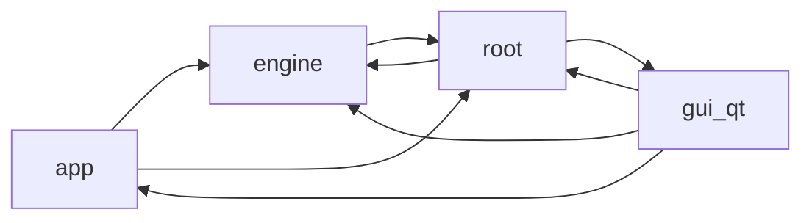

# Codebase audit overview

The generated findings below were manually triaged in the curated [audit findings review](../findings-review.md). Keep verdicts and remediation notes in the curated review; this generated block is replaced on audit refresh.

<!-- audit:generated:start overview -->
## Architecture

## Analyzer status

| Analyzer | Status | Detail |
|---|---|---|
| ruff | available | - |
| vulture | available | - |
| radon | available | - |
| deps | available | - |
| contracts | available | - |

## Headline metrics

| Metric | Value |
|---|---|
| Modules | 176 |
| Total LOC | 38404 |
| Statement coverage | 44.6% |
| Module-average coverage | 52.6% |
| Import cycles | 2 |
| Modules over complexity threshold | 62 |
| Dead symbols (high confidence) | 0 |

## Coverage provenance

| Status | Source | Input digest | Detail |
|---|---|---|---|
| matched | imported | 4df68a01176e | - |

## Least-covered modules

| Module | Statements | Covered | Coverage |
|---|---:|---:|---:|
| `plex_renamer/__main__.py` | 18 | 0 | 0.0% |
| `plex_renamer/engine/_core.py` | 9 | 0 | 0.0% |
| `plex_renamer/gui_qt/_main_window_bootstrap.py` | 38 | 0 | 0.0% |
| `plex_renamer/gui_qt/_main_window_bridges.py` | 79 | 0 | 0.0% |
| `plex_renamer/gui_qt/_main_window_chrome.py` | 76 | 0 | 0.0% |
| `plex_renamer/gui_qt/_main_window_feedback.py` | 159 | 0 | 0.0% |
| `plex_renamer/gui_qt/_main_window_scan.py` | 112 | 0 | 0.0% |
| `plex_renamer/gui_qt/_main_window_shell.py` | 40 | 0 | 0.0% |
| `plex_renamer/gui_qt/_main_window_shortcuts.py` | 58 | 0 | 0.0% |
| `plex_renamer/gui_qt/_main_window_state.py` | 121 | 0 | 0.0% |

## Largest modules

| Module | LOC |
|---|---|
| `plex_renamer/engine/_episode_resolution.py` | 1938 |
| `plex_renamer/engine/_batch_orchestrators.py` | 1037 |
| `plex_renamer/gui_qt/widgets/_episode_table_model.py` | 911 |
| `plex_renamer/job_executor.py` | 907 |
| `plex_renamer/gui_qt/widgets/_work_panel.py` | 852 |
| `plex_renamer/gui_qt/widgets/_bulk_assign_panel.py` | 760 |
| `plex_renamer/engine/_tv_scanner_consolidated.py` | 685 |
| `plex_renamer/gui_qt/widgets/_episode_table_delegate.py` | 665 |
| `plex_renamer/job_store.py` | 621 |
| `plex_renamer/gui_qt/widgets/job_detail_panel.py` | 618 |

## Most complex

| Module | Max CC |
|---|---|
| `plex_renamer/_parsing_episodes.py` | 59 |
| `plex_renamer/engine/_episode_resolution.py` | 49 |
| `plex_renamer/engine/_tv_scanner_normal.py` | 44 |
| `plex_renamer/job_executor.py` | 43 |
| `plex_renamer/app/services/_tv_library_classification.py` | 42 |
| `plex_renamer/gui_qt/widgets/_media_workspace_actions.py` | 42 |
| `plex_renamer/engine/_tv_scanner_consolidated.py` | 40 |
| `plex_renamer/app/services/metadata_service.py` | 35 |
| `plex_renamer/engine/_rename_execution.py` | 35 |
| `plex_renamer/gui_qt/models/job_table_model.py` | 35 |

## Most depended upon

| Module | Fan-in |
|---|---|
| `plex_renamer/constants.py` | 49 |
| `plex_renamer/engine/__init__.py` | 42 |
| `plex_renamer/gui_qt/_scale.py` | 24 |
| `plex_renamer/parsing.py` | 24 |
| `plex_renamer/app/models/__init__.py` | 23 |
| `plex_renamer/engine/models.py` | 20 |
| `plex_renamer/job_store.py` | 16 |
| `plex_renamer/gui_qt/theme.py` | 14 |
| `plex_renamer/gui_qt/widgets/_media_helpers.py` | 12 |
| `plex_renamer/thread_pool.py` | 12 |

## Dependency issues

_None. Declared dependencies match imports._

## Layer contracts

_No violations._

## External effects

| Module | Effects |
|---|---|
| `plex_renamer/__main__.py` | env |
| `plex_renamer/_job_execution_filesystem.py` | file-delete, file-move, file-write |
| `plex_renamer/_job_execution_metadata.py` | file-delete, file-move, file-write, subprocess |
| `plex_renamer/_job_execution_remux.py` | file-delete, file-move, file-write, subprocess |
| `plex_renamer/_mkv_locate.py` | env |
| `plex_renamer/_mkv_probe.py` | subprocess |
| `plex_renamer/_tmdb_transport.py` | network |
| `plex_renamer/app/services/settings_service.py` | file-move, file-write |
| `plex_renamer/constants.py` | file-write |
| `plex_renamer/engine/_rename_execution.py` | file-delete, file-move, file-write |
| `plex_renamer/gui_qt/app.py` | env |
| `plex_renamer/gui_qt/widgets/_settings_tab_actions.py` | network |
| `plex_renamer/job_executor.py` | file-delete, file-move, file-write |
| `plex_renamer/job_store.py` | file-delete |
| `plex_renamer/keys.py` | file-write |

## Dead-code review checklist

### High confidence

_None._

### Medium confidence

_None._

### Protected or ambiguous

- [ ] `plex_renamer/_job_store_db.py:58` row_factory (Vulture 60%; production refs: none; test refs: none; assessment: dynamic-or-unresolved)
- [ ] `plex_renamer/_mkv_probe.py:31` is_forced (Vulture 60%; production refs: none; test refs: none; assessment: dynamic-or-unresolved)
- [ ] `plex_renamer/_mkv_probe.py:39` container_type (Vulture 60%; production refs: none; test refs: none; assessment: dynamic-or-unresolved)
- [ ] `plex_renamer/app/controllers/media_controller.py:368` accept_tv_show (Vulture 60%; production refs: none; test refs: none; assessment: dynamic-or-unresolved)
- [ ] `plex_renamer/app/controllers/queue_controller.py:88` pending_count (Vulture 60%; production refs: none; test refs: none; assessment: dynamic-or-unresolved)
- [ ] `plex_renamer/app/controllers/queue_controller.py:95` add_single_job (Vulture 60%; production refs: none; test refs: none; assessment: dynamic-or-unresolved)
- [ ] `plex_renamer/app/models/state_models.py:93` last_accessed_at (Vulture 60%; production refs: none; test refs: none; assessment: dynamic-or-unresolved)
- [ ] `plex_renamer/app/models/state_models.py:122` actionable_indices (Vulture 60%; production refs: none; test refs: none; assessment: dynamic-or-unresolved)
- [ ] `plex_renamer/app/models/state_models.py:126` eligible_job_count (Vulture 60%; production refs: none; test refs: none; assessment: dynamic-or-unresolved)
- [ ] `plex_renamer/app/models/state_models.py:135` mapped_episodes (Vulture 60%; production refs: none; test refs: none; assessment: dynamic-or-unresolved)
- [ ] `plex_renamer/app/models/state_models.py:138` missing_episodes (Vulture 60%; production refs: none; test refs: none; assessment: dynamic-or-unresolved)
- [ ] `plex_renamer/app/models/state_models.py:142` review_required (Vulture 60%; production refs: none; test refs: none; assessment: dynamic-or-unresolved)
- [ ] `plex_renamer/app/models/state_models.py:160` episode_key (Vulture 60%; production refs: none; test refs: none; assessment: dynamic-or-unresolved)
- [ ] `plex_renamer/app/models/state_models.py:194` source_label (Vulture 60%; production refs: none; test refs: none; assessment: dynamic-or-unresolved)
- [ ] `plex_renamer/app/services/cache_service.py:47` row_factory (Vulture 60%; production refs: none; test refs: none; assessment: dynamic-or-unresolved)
- [ ] `plex_renamer/app/services/cache_service.py:81` make_key (Vulture 60%; production refs: none; test refs: none; assessment: dynamic-or-unresolved)
- [ ] `plex_renamer/app/services/cache_service.py:185` mark_refreshing (Vulture 60%; production refs: none; test refs: none; assessment: dynamic-or-unresolved)
- [ ] `plex_renamer/app/services/cache_service.py:202` invalidate_namespace (Vulture 60%; production refs: none; test refs: none; assessment: dynamic-or-unresolved)
- [ ] `plex_renamer/app/services/cache_service.py:221` invalidate_by_prefix (Vulture 60%; production refs: none; test refs: none; assessment: dynamic-or-unresolved)
- [ ] `plex_renamer/app/services/episode_mapping_service.py:130` apply_assignments (Vulture 60%; production refs: none; test refs: none; assessment: dynamic-or-unresolved)
- [ ] `plex_renamer/app/services/episode_projection_cache.py:24` cache_size (Vulture 60%; production refs: none; test refs: none; assessment: dynamic-or-unresolved)
- [ ] `plex_renamer/app/services/refresh_policy_service.py:27` retry_after_seconds (Vulture 60%; production refs: none; test refs: none; assessment: dynamic-or-unresolved)
- [ ] `plex_renamer/app/services/refresh_policy_service.py:102` should_background_refresh (Vulture 60%; production refs: none; test refs: none; assessment: dynamic-or-unresolved)
- [ ] `plex_renamer/app/services/refresh_policy_service.py:119` can_manual_refresh (Vulture 60%; production refs: none; test refs: none; assessment: dynamic-or-unresolved)
- [ ] `plex_renamer/app/services/refresh_policy_service.py:142` get_rescan_scope (Vulture 60%; production refs: none; test refs: none; assessment: dynamic-or-unresolved)
- [ ] `plex_renamer/app/services/settings_service.py:81` match_country (Vulture 60%; production refs: none; test refs: none; assessment: dynamic-or-unresolved)
- [ ] `plex_renamer/constants.py:67` SUBTITLE_DOWNLOAD (Vulture 60%; production refs: none; test refs: none; assessment: dynamic-or-unresolved)
- [ ] `plex_renamer/engine/_batch_orchestrators.py:817` discover_movies (Vulture 60%; production refs: none; test refs: none; assessment: dynamic-or-unresolved)
- [ ] `plex_renamer/engine/_movie_scanner.py:109` explicit_files (Vulture 60%; production refs: none; test refs: none; assessment: dynamic-or-unresolved)
- [ ] `plex_renamer/engine/_mux_planner.py:57` output_name (Vulture 60%; production refs: none; test refs: none; assessment: dynamic-or-unresolved)
- [ ] `plex_renamer/engine/_mux_planner.py:64` user_modified (Vulture 60%; production refs: none; test refs: none; assessment: dynamic-or-unresolved)
- [ ] `plex_renamer/engine/episode_assignments.py:254` unclaimed_slots (Vulture 60%; production refs: none; test refs: none; assessment: dynamic-or-unresolved)
- [ ] `plex_renamer/engine/show_details.py:26` first_air_date (Vulture 60%; production refs: none; test refs: none; assessment: dynamic-or-unresolved)
- [ ] `plex_renamer/gui_qt/models/job_status_filter_proxy_model.py:26` filterAcceptsRow (Vulture 60%; production refs: none; test refs: none; assessment: dynamic-or-unresolved)
- [ ] `plex_renamer/gui_qt/models/job_status_filter_proxy_model.py:26` source_parent (Vulture 100%; production refs: none; test refs: none; assessment: dynamic-or-unresolved)
- [ ] `plex_renamer/gui_qt/models/job_table_model.py:193` headerData (Vulture 60%; production refs: none; test refs: none; assessment: dynamic-or-unresolved)
- [ ] `plex_renamer/gui_qt/widgets/_automux_tracks.py:207` minimumSizeHint (Vulture 60%; production refs: none; test refs: none; assessment: dynamic-or-unresolved)
- [ ] `plex_renamer/gui_qt/widgets/_bulk_assign_panel.py:201` mimeTypes (Vulture 60%; production refs: none; test refs: none; assessment: dynamic-or-unresolved)
- [ ] `plex_renamer/gui_qt/widgets/_bulk_assign_panel.py:227` startDrag (Vulture 60%; production refs: none; test refs: none; assessment: dynamic-or-unresolved)
- [ ] `plex_renamer/gui_qt/widgets/_bulk_assign_panel.py:227` supportedActions (Vulture 100%; production refs: none; test refs: none; assessment: dynamic-or-unresolved)
- [ ] `plex_renamer/gui_qt/widgets/_bulk_assign_panel.py:329` is_claimed (Vulture 60%; production refs: none; test refs: none; assessment: dynamic-or-unresolved)
- [ ] `plex_renamer/gui_qt/widgets/_bulk_assign_panel.py:395` dragEnterEvent (Vulture 60%; production refs: none; test refs: none; assessment: dynamic-or-unresolved)
- [ ] `plex_renamer/gui_qt/widgets/_bulk_assign_panel.py:401` dragMoveEvent (Vulture 60%; production refs: none; test refs: none; assessment: dynamic-or-unresolved)
- [ ] `plex_renamer/gui_qt/widgets/_bulk_assign_panel.py:407` dropEvent (Vulture 60%; production refs: none; test refs: none; assessment: dynamic-or-unresolved)
- [ ] `plex_renamer/gui_qt/widgets/_bulk_assign_panel.py:550` _claimed_file_by_key (Vulture 60%; production refs: none; test refs: none; assessment: dynamic-or-unresolved)
- [ ] `plex_renamer/gui_qt/widgets/_bulk_assign_panel.py:678` _select_file (Vulture 60%; production refs: none; test refs: none; assessment: dynamic-or-unresolved)
- [ ] `plex_renamer/gui_qt/widgets/_episode_expansion.py:212` _header_row (Vulture 60%; production refs: none; test refs: none; assessment: dynamic-or-unresolved)
- [ ] `plex_renamer/gui_qt/widgets/_episode_expansion.py:320` header_action_buttons (Vulture 60%; production refs: none; test refs: none; assessment: dynamic-or-unresolved)
- [ ] `plex_renamer/gui_qt/widgets/_episode_expansion.py:325` action_buttons (Vulture 60%; production refs: none; test refs: none; assessment: dynamic-or-unresolved)
- [ ] `plex_renamer/gui_qt/widgets/_episode_expansion.py:329` status_pill_text (Vulture 60%; production refs: none; test refs: none; assessment: dynamic-or-unresolved)
- [ ] `plex_renamer/gui_qt/widgets/_episode_expansion.py:332` mux_optout_button (Vulture 60%; production refs: none; test refs: none; assessment: dynamic-or-unresolved)
- [ ] `plex_renamer/gui_qt/widgets/_episode_expansion.py:390` _copy_buttons (Vulture 60%; production refs: none; test refs: none; assessment: dynamic-or-unresolved)
- [ ] `plex_renamer/gui_qt/widgets/_episode_table_delegate.py:336` createEditor (Vulture 60%; production refs: none; test refs: none; assessment: dynamic-or-unresolved)
- [ ] `plex_renamer/gui_qt/widgets/_episode_table_delegate.py:348` updateEditorGeometry (Vulture 60%; production refs: none; test refs: none; assessment: dynamic-or-unresolved)
- [ ] `plex_renamer/gui_qt/widgets/_episode_table_model.py:245` filter_mode (Vulture 60%; production refs: none; test refs: none; assessment: dynamic-or-unresolved)
- [ ] `plex_renamer/gui_qt/widgets/_episode_table_model.py:323` row_for_preview_index (Vulture 60%; production refs: none; test refs: none; assessment: dynamic-or-unresolved)
- [ ] `plex_renamer/gui_qt/widgets/_job_list_tab.py:138` backgroundBrush (Vulture 60%; production refs: none; test refs: none; assessment: dynamic-or-unresolved)
- [ ] `plex_renamer/gui_qt/widgets/_roster_model.py:188` entry_kind_at (Vulture 60%; production refs: none; test refs: none; assessment: dynamic-or-unresolved)
- [ ] `plex_renamer/gui_qt/widgets/_roster_model.py:193` group_at (Vulture 60%; production refs: none; test refs: none; assessment: dynamic-or-unresolved)
- [ ] `plex_renamer/gui_qt/widgets/_settings_automux_page.py:100` _merge_subs_cb (Vulture 60%; production refs: none; test refs: none; assessment: dynamic-or-unresolved)
- [ ] `plex_renamer/gui_qt/widgets/_settings_automux_page.py:102` _merge_langs_edit (Vulture 60%; production refs: none; test refs: none; assessment: dynamic-or-unresolved)
- [ ] `plex_renamer/gui_qt/widgets/_settings_automux_page.py:124` _default_audio_edit (Vulture 60%; production refs: none; test refs: none; assessment: dynamic-or-unresolved)
- [ ] `plex_renamer/gui_qt/widgets/_settings_automux_page.py:131` _no_fear_cb (Vulture 60%; production refs: none; test refs: none; assessment: dynamic-or-unresolved)
- [ ] `plex_renamer/gui_qt/widgets/_settings_tab_sections.py:131` _destinations_page (Vulture 60%; production refs: none; test refs: none; assessment: dynamic-or-unresolved)
- [ ] `plex_renamer/gui_qt/widgets/_work_panel.py:121` check_summary (Vulture 60%; production refs: none; test refs: none; assessment: dynamic-or-unresolved)
- [ ] `plex_renamer/gui_qt/widgets/_work_panel.py:133` search_box (Vulture 60%; production refs: none; test refs: none; assessment: dynamic-or-unresolved)
- [ ] `plex_renamer/gui_qt/widgets/_work_panel.py:137` episode_search_box (Vulture 60%; production refs: none; test refs: none; assessment: dynamic-or-unresolved)
- [ ] `plex_renamer/gui_qt/widgets/_work_panel.py:141` segmented_filter (Vulture 60%; production refs: none; test refs: none; assessment: dynamic-or-unresolved)
- [ ] `plex_renamer/gui_qt/widgets/_work_panel.py:145` approve_all_button (Vulture 60%; production refs: none; test refs: none; assessment: dynamic-or-unresolved)
- [ ] `plex_renamer/gui_qt/widgets/_work_panel.py:149` summary_label (Vulture 60%; production refs: none; test refs: none; assessment: dynamic-or-unresolved)
- [ ] `plex_renamer/gui_qt/widgets/_work_panel.py:157` overflow_button (Vulture 60%; production refs: none; test refs: none; assessment: dynamic-or-unresolved)
- [ ] `plex_renamer/gui_qt/widgets/_workspace_widget_primitives.py:92` nextCheckState (Vulture 60%; production refs: none; test refs: none; assessment: dynamic-or-unresolved)
- [ ] `plex_renamer/gui_qt/widgets/empty_state.py:153` dragEnterEvent (Vulture 60%; production refs: none; test refs: none; assessment: dynamic-or-unresolved)
- [ ] `plex_renamer/gui_qt/widgets/empty_state.py:164` dragLeaveEvent (Vulture 60%; production refs: none; test refs: none; assessment: dynamic-or-unresolved)
- [ ] `plex_renamer/gui_qt/widgets/empty_state.py:169` dropEvent (Vulture 60%; production refs: none; test refs: none; assessment: dynamic-or-unresolved)
- [ ] `plex_renamer/gui_qt/widgets/episode_assign_dialog.py:178` set_checked (Vulture 60%; production refs: none; test refs: none; assessment: dynamic-or-unresolved)
- [ ] `plex_renamer/gui_qt/widgets/episode_assign_dialog.py:192` is_season_expanded (Vulture 60%; production refs: none; test refs: none; assessment: dynamic-or-unresolved)
- [ ] `plex_renamer/gui_qt/widgets/episode_assign_dialog.py:208` is_selection_valid (Vulture 60%; production refs: none; test refs: none; assessment: dynamic-or-unresolved)
- [ ] `plex_renamer/gui_qt/widgets/episode_assign_dialog.py:211` validation_text (Vulture 60%; production refs: none; test refs: none; assessment: dynamic-or-unresolved)
- [ ] `plex_renamer/gui_qt/widgets/episode_assign_dialog.py:214` slot_row_text (Vulture 60%; production refs: none; test refs: none; assessment: dynamic-or-unresolved)
- [ ] `plex_renamer/gui_qt/widgets/tab_badge.py:52` count_text (Vulture 60%; production refs: none; test refs: none; assessment: dynamic-or-unresolved)
- [ ] `plex_renamer/gui_qt/widgets/tab_badge.py:64` failure_visible (Vulture 60%; production refs: none; test refs: none; assessment: dynamic-or-unresolved)
- [ ] `plex_renamer/job_store.py:431` reorder_job (Vulture 60%; production refs: none; test refs: none; assessment: dynamic-or-unresolved)

### Test referenced

- [ ] `plex_renamer/_mkv_probe.py:80` clear_probe_cache (Vulture 60%; production refs: none; test refs: tests/test_mkv_probe.py, tests/test_mkvmerge_integration.py; assessment: test-referenced)
- [ ] `plex_renamer/engine/episode_assignments.py:21` ROLE_VERSION (Vulture 60%; production refs: none; test refs: tests/test_episode_assignments.py; assessment: test-referenced)
- [ ] `plex_renamer/gui_qt/_scale.py:52` row_height (Vulture 60%; production refs: none; test refs: tests/test_qt_scale.py; assessment: test-referenced)

### Allowlisted

- [x] `plex_renamer/app/models/state_models.py:27` REFRESHING_CACHE (Vulture 60%; production refs: none; test refs: none; assessment: dynamic-or-unresolved; allowlist: Exported ScanLifecycle compatibility value reserved for cache-refresh progress)
- [x] `plex_renamer/gui_qt/widgets/_episode_expansion.py:137` paintEvent (Vulture 60%; production refs: none; test refs: none; assessment: dynamic-or-unresolved; allowlist: Qt event handler, called by framework)
- [x] `plex_renamer/gui_qt/widgets/_workspace_widget_primitives.py:103` paintEvent (Vulture 60%; production refs: none; test refs: none; assessment: dynamic-or-unresolved; allowlist: Qt event handler, called by framework)
- [x] `plex_renamer/gui_qt/widgets/busy_overlay.py:52` paintEvent (Vulture 60%; production refs: none; test refs: none; assessment: dynamic-or-unresolved; allowlist: Qt event handler, called by framework)
- [x] `plex_renamer/gui_qt/widgets/busy_overlay.py:89` paintEvent (Vulture 60%; production refs: none; test refs: none; assessment: dynamic-or-unresolved; allowlist: Qt event handler, called by framework)
- [x] `plex_renamer/gui_qt/widgets/scan_progress.py:165` paintEvent (Vulture 60%; production refs: none; test refs: none; assessment: dynamic-or-unresolved; allowlist: Qt event handler, called by framework)

_Generated from audit input 4df68a01176e by scripts\audit.cmd._
<!-- audit:generated:end overview -->
