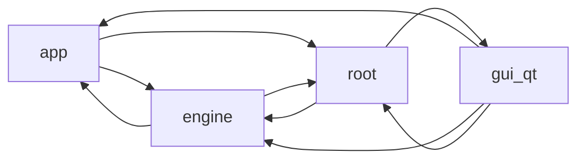

<!-- audit:generated:start overview -->
## Architecture

## Headline metrics

| Metric | Value |
|---|---|
| Modules | 175 |
| Total LOC | 39056 |
| Avg coverage | 70.6% |
| Import cycles | 2 |
| Modules over complexity threshold | 62 |
| Dead symbols (high confidence) | 17 |

## Largest modules

| Module | LOC |
|---|---|
| `plex_renamer/engine/_episode_resolution.py` | 1938 |
| `plex_renamer/engine/_batch_orchestrators.py` | 1123 |
| `plex_renamer/gui_qt/widgets/_episode_table_model.py` | 929 |
| `plex_renamer/job_executor.py` | 907 |
| `plex_renamer/gui_qt/widgets/_work_panel.py` | 853 |
| `plex_renamer/gui_qt/widgets/_bulk_assign_panel.py` | 761 |
| `plex_renamer/job_store.py` | 687 |
| `plex_renamer/engine/_tv_scanner_consolidated.py` | 685 |
| `plex_renamer/gui_qt/widgets/_episode_table_delegate.py` | 667 |
| `plex_renamer/gui_qt/widgets/job_detail_panel.py` | 621 |

## Most complex

| Module | Max CC |
|---|---|
| `plex_renamer/_parsing_episodes.py` | 59 |
| `plex_renamer/engine/_episode_resolution.py` | 49 |
| `plex_renamer/engine/_tv_scanner_normal.py` | 44 |
| `plex_renamer/job_executor.py` | 43 |
| `plex_renamer/app/services/_tv_library_classification.py` | 42 |
| `plex_renamer/gui_qt/widgets/_media_workspace_actions.py` | 42 |
| `plex_renamer/engine/_tv_scanner_consolidated.py` | 40 |
| `plex_renamer/app/services/metadata_service.py` | 35 |
| `plex_renamer/engine/_rename_execution.py` | 35 |
| `plex_renamer/gui_qt/models/job_table_model.py` | 35 |

## Most depended upon

| Module | Fan-in |
|---|---|
| `plex_renamer/constants.py` | 49 |
| `plex_renamer/engine/__init__.py` | 43 |
| `plex_renamer/parsing.py` | 26 |
| `plex_renamer/gui_qt/_scale.py` | 24 |
| `plex_renamer/app/models/__init__.py` | 23 |
| `plex_renamer/engine/models.py` | 20 |
| `plex_renamer/job_store.py` | 16 |
| `plex_renamer/gui_qt/theme.py` | 14 |
| `plex_renamer/gui_qt/widgets/_media_helpers.py` | 12 |
| `plex_renamer/thread_pool.py` | 12 |

## Dependency issues

_None. Declared dependencies match imports._

## Layer contracts

- `plex_renamer/engine/_batch_orchestrators.py` plex_renamer.app.services (forbidden-import) - plex_renamer.engine._batch_orchestrators imports plex_renamer.app.services - forbidden by contract plex_renamer.engine -> plex_renamer.app (engine is the bottom layer - orchestration imports engine, not the reverse)
- `plex_renamer/engine/_movie_scanner.py` plex_renamer.app.services (forbidden-import) - plex_renamer.engine._movie_scanner imports plex_renamer.app.services - forbidden by contract plex_renamer.engine -> plex_renamer.app (engine is the bottom layer - orchestration imports engine, not the reverse)

## External effects

| Module | Effects |
|---|---|
| `plex_renamer/__main__.py` | env |
| `plex_renamer/_job_execution_filesystem.py` | file-delete, file-move, file-write |
| `plex_renamer/_job_execution_metadata.py` | file-delete, file-move, file-write, subprocess |
| `plex_renamer/_job_execution_remux.py` | file-delete, file-move, file-write, subprocess |
| `plex_renamer/_mkv_locate.py` | env |
| `plex_renamer/_mkv_probe.py` | subprocess |
| `plex_renamer/_tmdb_transport.py` | network |
| `plex_renamer/app/services/settings_service.py` | file-move, file-write |
| `plex_renamer/constants.py` | file-write |
| `plex_renamer/engine/_rename_execution.py` | file-delete, file-move, file-write |
| `plex_renamer/gui_qt/app.py` | env |
| `plex_renamer/gui_qt/widgets/_settings_tab_actions.py` | network |
| `plex_renamer/job_executor.py` | file-delete, file-move, file-write |
| `plex_renamer/job_store.py` | file-delete |
| `plex_renamer/keys.py` | file-write |

## Dead-code review checklist

- [ ] `plex_renamer/_job_store_db.py:58` row_factory (low-confidence)
- [ ] `plex_renamer/_mkv_probe.py:31` is_forced (low-confidence)
- [ ] `plex_renamer/_mkv_probe.py:39` container_type (low-confidence)
- [ ] `plex_renamer/_mkv_probe.py:80` clear_probe_cache (high-confidence)
- [ ] `plex_renamer/app/controllers/media_controller.py:96` _movie_discovery (low-confidence)
- [ ] `plex_renamer/app/controllers/media_controller.py:371` accept_tv_show (low-confidence)
- [ ] `plex_renamer/app/controllers/queue_controller.py:89` pending_count (low-confidence)
- [ ] `plex_renamer/app/controllers/queue_controller.py:96` add_single_job (low-confidence)
- [ ] `plex_renamer/app/controllers/queue_controller.py:183` record_completed_job (low-confidence)
- [ ] `plex_renamer/app/controllers/queue_controller.py:197` get_latest_revertible_job (low-confidence)
- [ ] `plex_renamer/app/models/state_models.py:84` is_active (low-confidence)
- [ ] `plex_renamer/app/models/state_models.py:106` last_accessed_at (low-confidence)
- [ ] `plex_renamer/app/models/state_models.py:129` is_fresh (low-confidence)
- [ ] `plex_renamer/app/models/state_models.py:144` eligible_job_count (low-confidence)
- [ ] `plex_renamer/app/models/state_models.py:153` mapped_episodes (low-confidence)
- [ ] `plex_renamer/app/models/state_models.py:156` missing_episodes (low-confidence)
- [ ] `plex_renamer/app/models/state_models.py:160` review_required (low-confidence)
- [ ] `plex_renamer/app/models/state_models.py:178` episode_key (low-confidence)
- [ ] `plex_renamer/app/models/state_models.py:188` ignored (low-confidence)
- [ ] `plex_renamer/app/models/state_models.py:213` source_label (low-confidence)
- [ ] `plex_renamer/app/services/cache_service.py:47` row_factory (low-confidence)
- [ ] `plex_renamer/app/services/cache_service.py:81` make_key (low-confidence)
- [ ] `plex_renamer/app/services/cache_service.py:185` mark_refreshing (low-confidence)
- [ ] `plex_renamer/app/services/cache_service.py:202` invalidate_namespace (low-confidence)
- [ ] `plex_renamer/app/services/cache_service.py:221` invalidate_by_prefix (low-confidence)
- [ ] `plex_renamer/app/services/episode_mapping_service.py:130` apply_assignments (low-confidence)
- [ ] `plex_renamer/app/services/episode_projection_cache.py:24` cache_size (low-confidence)
- [ ] `plex_renamer/app/services/refresh_policy_service.py:27` retry_after_seconds (low-confidence)
- [ ] `plex_renamer/app/services/refresh_policy_service.py:102` should_background_refresh (low-confidence)
- [ ] `plex_renamer/app/services/refresh_policy_service.py:119` can_manual_refresh (low-confidence)
- [ ] `plex_renamer/app/services/refresh_policy_service.py:142` get_rescan_scope (low-confidence)
- [ ] `plex_renamer/app/services/settings_service.py:81` match_country (low-confidence)
- [ ] `plex_renamer/app/services/tv_library_discovery_service.py:173` _counts_as_season_subdir (low-confidence)
- [ ] `plex_renamer/app/services/tv_library_discovery_service.py:176` _scan_children (low-confidence)
- [ ] `plex_renamer/app/services/tv_library_discovery_service.py:198` _child_title_matches_parent (low-confidence)
- [ ] `plex_renamer/constants.py:67` SUBTITLE_DOWNLOAD (low-confidence)
- [ ] `plex_renamer/engine/_batch_orchestrators.py:150` _boost_tv_scores_with_episode_evidence (low-confidence)
- [ ] `plex_renamer/engine/_batch_orchestrators.py:751` is_tv_library (low-confidence)
- [ ] `plex_renamer/engine/_batch_orchestrators.py:878` discover_movies (low-confidence)
- [ ] `plex_renamer/engine/_batch_orchestrators.py:1101` rematch_movie (low-confidence)
- [ ] `plex_renamer/engine/_movie_scanner.py:105` explicit_files (low-confidence)
- [ ] `plex_renamer/engine/_mux_planner.py:57` output_name (low-confidence)
- [ ] `plex_renamer/engine/_mux_planner.py:64` user_modified (low-confidence)
- [ ] `plex_renamer/engine/_tv_scanner.py:121` invalidate_cache (low-confidence)
- [ ] `plex_renamer/engine/_tv_scanner.py:174` get_mismatch_info (low-confidence)
- [ ] `plex_renamer/engine/episode_assignments.py:21` ROLE_VERSION (low-confidence)
- [ ] `plex_renamer/engine/episode_assignments.py:254` unclaimed_slots (low-confidence)
- [ ] `plex_renamer/engine/episode_assignments.py:264` ingest_preview_items (high-confidence)
- [ ] `plex_renamer/engine/models.py:80` is_move (low-confidence)
- [ ] `plex_renamer/engine/models.py:269` match_pct (low-confidence)
- [ ] `plex_renamer/engine/models.py:275` all_skipped (low-confidence)
- [ ] `plex_renamer/engine/models.py:288` actionable_file_count (low-confidence)
- [ ] `plex_renamer/engine/show_details.py:26` first_air_date (low-confidence)
- [ ] `plex_renamer/gui_qt/_scale.py:52` row_height (high-confidence)
- [ ] `plex_renamer/gui_qt/app.py:140` _popup_filter (low-confidence)
- [ ] `plex_renamer/gui_qt/main_window.py:167` _restore_tmdb_cache_snapshot (low-confidence)
- [ ] `plex_renamer/gui_qt/main_window.py:200` _refresh_media_workspaces (low-confidence)
- [ ] `plex_renamer/gui_qt/main_window.py:248` _active_media_workspace_for_shortcuts (low-confidence)
- [ ] `plex_renamer/gui_qt/main_window.py:257` _text_input_focused (low-confidence)
- [ ] `plex_renamer/gui_qt/main_window.py:279` _active_workspace (low-confidence)
- [ ] `plex_renamer/gui_qt/main_window.py:346` _capture_active_snapshot (low-confidence)
- [ ] `plex_renamer/gui_qt/main_window.py:363` _save_window_state (low-confidence)
- [ ] `plex_renamer/gui_qt/models/job_status_filter_proxy_model.py:26` filterAcceptsRow (low-confidence)
- [ ] `plex_renamer/gui_qt/models/job_status_filter_proxy_model.py:26` source_parent (low-confidence)
- [ ] `plex_renamer/gui_qt/models/job_table_model.py:193` headerData (low-confidence)
- [ ] `plex_renamer/gui_qt/widgets/_automux_tracks.py:207` minimumSizeHint (low-confidence)
- [ ] `plex_renamer/gui_qt/widgets/_bulk_assign_panel.py:201` mimeTypes (low-confidence)
- [ ] `plex_renamer/gui_qt/widgets/_bulk_assign_panel.py:227` startDrag (low-confidence)
- [ ] `plex_renamer/gui_qt/widgets/_bulk_assign_panel.py:227` supportedActions (low-confidence)
- [ ] `plex_renamer/gui_qt/widgets/_bulk_assign_panel.py:329` is_claimed (low-confidence)
- [ ] `plex_renamer/gui_qt/widgets/_bulk_assign_panel.py:395` dragEnterEvent (low-confidence)
- [ ] `plex_renamer/gui_qt/widgets/_bulk_assign_panel.py:401` dragMoveEvent (low-confidence)
- [ ] `plex_renamer/gui_qt/widgets/_bulk_assign_panel.py:407` dropEvent (low-confidence)
- [ ] `plex_renamer/gui_qt/widgets/_bulk_assign_panel.py:442` _claimed_file_by_key (low-confidence)
- [ ] `plex_renamer/gui_qt/widgets/_bulk_assign_panel.py:551` _claimed_file_by_key (low-confidence)
- [ ] `plex_renamer/gui_qt/widgets/_bulk_assign_panel.py:679` _select_file (low-confidence)
- [ ] `plex_renamer/gui_qt/widgets/_episode_expansion.py:158` _copy_buttons (low-confidence)
- [ ] `plex_renamer/gui_qt/widgets/_episode_expansion.py:162` _header_row (low-confidence)
- [ ] `plex_renamer/gui_qt/widgets/_episode_expansion.py:214` _header_row (low-confidence)
- [ ] `plex_renamer/gui_qt/widgets/_episode_expansion.py:322` header_action_buttons (low-confidence)
- [ ] `plex_renamer/gui_qt/widgets/_episode_expansion.py:327` action_buttons (low-confidence)
- [ ] `plex_renamer/gui_qt/widgets/_episode_expansion.py:331` status_pill_text (low-confidence)
- [ ] `plex_renamer/gui_qt/widgets/_episode_expansion.py:334` mux_optout_button (low-confidence)
- [ ] `plex_renamer/gui_qt/widgets/_episode_expansion.py:392` _copy_buttons (low-confidence)
- [ ] `plex_renamer/gui_qt/widgets/_episode_table_delegate.py:92` expansion_requested (low-confidence)
- [ ] `plex_renamer/gui_qt/widgets/_episode_table_delegate.py:338` createEditor (low-confidence)
- [ ] `plex_renamer/gui_qt/widgets/_episode_table_delegate.py:350` updateEditorGeometry (low-confidence)
- [ ] `plex_renamer/gui_qt/widgets/_episode_table_model.py:123` collapsible (low-confidence)
- [ ] `plex_renamer/gui_qt/widgets/_episode_table_model.py:246` filter_mode (low-confidence)
- [ ] `plex_renamer/gui_qt/widgets/_episode_table_model.py:256` search_text (low-confidence)
- [ ] `plex_renamer/gui_qt/widgets/_episode_table_model.py:266` episode_search (low-confidence)
- [ ] `plex_renamer/gui_qt/widgets/_episode_table_model.py:330` row_for_preview_index (low-confidence)
- [ ] `plex_renamer/gui_qt/widgets/_episode_table_model.py:394` refresh_checks (low-confidence)
- [ ] `plex_renamer/gui_qt/widgets/_image_utils.py:104` ShimmerOverlay (high-confidence)
- [ ] `plex_renamer/gui_qt/widgets/_job_detail_poster.py:90` _poster_pixmap (low-confidence)
- [ ] `plex_renamer/gui_qt/widgets/_job_detail_poster.py:110` _poster_pixmap (low-confidence)
- [ ] `plex_renamer/gui_qt/widgets/_job_list_tab.py:138` backgroundBrush (low-confidence)
- [ ] `plex_renamer/gui_qt/widgets/_job_list_tab.py:402` _insert_panel_before_detail (low-confidence)
- [ ] `plex_renamer/gui_qt/widgets/_media_helpers.py:23` file_count_for_state (high-confidence)
- [ ] `plex_renamer/gui_qt/widgets/_media_helpers.py:192` state_match_summary (high-confidence)
- [ ] `plex_renamer/gui_qt/widgets/_media_helpers.py:230` roster_signature (high-confidence)
- [ ] `plex_renamer/gui_qt/widgets/_media_helpers.py:254` match_label (high-confidence)
- [ ] `plex_renamer/gui_qt/widgets/_media_helpers.py:295` preview_band (high-confidence)
- [ ] `plex_renamer/gui_qt/widgets/_media_helpers.py:307` preview_heading (high-confidence)
- [ ] `plex_renamer/gui_qt/widgets/_media_helpers.py:316` preview_target_text (high-confidence)
- [ ] `plex_renamer/gui_qt/widgets/_media_helpers.py:321` tv_preview_sort_key (high-confidence)
- [ ] `plex_renamer/gui_qt/widgets/_media_helpers.py:340` companion_summary (high-confidence)
- [ ] `plex_renamer/gui_qt/widgets/_media_helpers.py:374` make_section_header (high-confidence)
- [ ] `plex_renamer/gui_qt/widgets/_media_workspace_ui.py:80` _roster_selection_summary (low-confidence)
- [ ] `plex_renamer/gui_qt/widgets/_roster_model.py:188` entry_kind_at (low-confidence)
- [ ] `plex_renamer/gui_qt/widgets/_roster_model.py:193` group_at (low-confidence)
- [ ] `plex_renamer/gui_qt/widgets/_settings_automux_page.py:100` _merge_subs_cb (low-confidence)
- [ ] `plex_renamer/gui_qt/widgets/_settings_automux_page.py:102` _merge_langs_edit (low-confidence)
- [ ] `plex_renamer/gui_qt/widgets/_settings_automux_page.py:105` _default_sub_edit (low-confidence)
- [ ] `plex_renamer/gui_qt/widgets/_settings_automux_page.py:107` _untagged_sub_edit (low-confidence)
- [ ] `plex_renamer/gui_qt/widgets/_settings_automux_page.py:112` _strip_subs_cb (low-confidence)
- [ ] `plex_renamer/gui_qt/widgets/_settings_automux_page.py:115` _retain_subs_edit (low-confidence)
- [ ] `plex_renamer/gui_qt/widgets/_settings_automux_page.py:119` _strip_audio_cb (low-confidence)
- [ ] `plex_renamer/gui_qt/widgets/_settings_automux_page.py:122` _retain_audio_edit (low-confidence)
- [ ] `plex_renamer/gui_qt/widgets/_settings_automux_page.py:124` _default_audio_edit (low-confidence)
- [ ] `plex_renamer/gui_qt/widgets/_settings_automux_page.py:128` _strip_names_cb (low-confidence)
- [ ] `plex_renamer/gui_qt/widgets/_settings_automux_page.py:131` _no_fear_cb (low-confidence)
- [ ] `plex_renamer/gui_qt/widgets/_settings_metadata_page.py:85` _nfo_cb (low-confidence)
- [ ] `plex_renamer/gui_qt/widgets/_settings_metadata_page.py:87` _episode_nfo_cb (low-confidence)
- [ ] `plex_renamer/gui_qt/widgets/_settings_metadata_page.py:89` _poster_cb (low-confidence)
- [ ] `plex_renamer/gui_qt/widgets/_settings_metadata_page.py:91` _fanart_cb (low-confidence)
- [ ] `plex_renamer/gui_qt/widgets/_settings_metadata_page.py:93` _season_posters_cb (low-confidence)
- [ ] `plex_renamer/gui_qt/widgets/_settings_metadata_page.py:95` _episode_thumbs_cb (low-confidence)
- [ ] `plex_renamer/gui_qt/widgets/_settings_metadata_page.py:98` _clearlogo_cb (low-confidence)
- [ ] `plex_renamer/gui_qt/widgets/_settings_metadata_page.py:100` _plex_naming_cb (low-confidence)
- [ ] `plex_renamer/gui_qt/widgets/_settings_metadata_page.py:111` _embed_title_cb (low-confidence)
- [ ] `plex_renamer/gui_qt/widgets/_settings_metadata_page.py:114` _embed_cover_cb (low-confidence)
- [ ] `plex_renamer/gui_qt/widgets/_settings_metadata_page.py:123` _embed_tags_cb (low-confidence)
- [ ] `plex_renamer/gui_qt/widgets/_settings_tab_sections.py:131` _destinations_page (low-confidence)
- [ ] `plex_renamer/gui_qt/widgets/_work_panel.py:121` check_summary (low-confidence)
- [ ] `plex_renamer/gui_qt/widgets/_work_panel.py:133` search_box (low-confidence)
- [ ] `plex_renamer/gui_qt/widgets/_work_panel.py:137` episode_search_box (low-confidence)
- [ ] `plex_renamer/gui_qt/widgets/_work_panel.py:141` segmented_filter (low-confidence)
- [ ] `plex_renamer/gui_qt/widgets/_work_panel.py:145` approve_all_button (low-confidence)
- [ ] `plex_renamer/gui_qt/widgets/_work_panel.py:149` summary_label (low-confidence)
- [ ] `plex_renamer/gui_qt/widgets/_work_panel.py:157` overflow_button (low-confidence)
- [ ] `plex_renamer/gui_qt/widgets/_workspace_widget_primitives.py:92` nextCheckState (low-confidence)
- [ ] `plex_renamer/gui_qt/widgets/_workspace_widget_primitives.py:166` ClickableRow (high-confidence)
- [ ] `plex_renamer/gui_qt/widgets/_workspace_widget_primitives.py:178` ToggleSwitch (high-confidence)
- [ ] `plex_renamer/gui_qt/widgets/_workspace_widget_primitives.py:205` MiniProgressBar (high-confidence)
- [ ] `plex_renamer/gui_qt/widgets/empty_state.py:154` dragEnterEvent (low-confidence)
- [ ] `plex_renamer/gui_qt/widgets/empty_state.py:165` dragLeaveEvent (low-confidence)
- [ ] `plex_renamer/gui_qt/widgets/empty_state.py:170` dropEvent (low-confidence)
- [ ] `plex_renamer/gui_qt/widgets/episode_assign_dialog.py:178` set_checked (low-confidence)
- [ ] `plex_renamer/gui_qt/widgets/episode_assign_dialog.py:192` is_season_expanded (low-confidence)
- [ ] `plex_renamer/gui_qt/widgets/episode_assign_dialog.py:208` is_selection_valid (low-confidence)
- [ ] `plex_renamer/gui_qt/widgets/episode_assign_dialog.py:211` validation_text (low-confidence)
- [ ] `plex_renamer/gui_qt/widgets/episode_assign_dialog.py:214` slot_row_text (low-confidence)
- [ ] `plex_renamer/gui_qt/widgets/job_detail_panel.py:231` _poster_pixmap (low-confidence)
- [ ] `plex_renamer/gui_qt/widgets/job_detail_panel.py:432` _poster_pixmap (low-confidence)
- [ ] `plex_renamer/gui_qt/widgets/job_detail_panel.py:461` _poster_pixmap (low-confidence)
- [ ] `plex_renamer/gui_qt/widgets/media_workspace.py:125` splitter (low-confidence)
- [ ] `plex_renamer/gui_qt/widgets/media_workspace.py:195` _preferred_batch_focus_index (low-confidence)
- [ ] `plex_renamer/gui_qt/widgets/media_workspace.py:207` _normalize_queue_selection (low-confidence)
- [ ] `plex_renamer/gui_qt/widgets/media_workspace.py:253` _update_preview_master_state (low-confidence)
- [ ] `plex_renamer/gui_qt/widgets/media_workspace.py:344` _selected_preview (low-confidence)
- [ ] `plex_renamer/gui_qt/widgets/media_workspace.py:347` _folder_plan_text (low-confidence)
- [ ] `plex_renamer/gui_qt/widgets/media_workspace.py:383` _season_expected_count (low-confidence)
- [ ] `plex_renamer/gui_qt/widgets/queue_tab.py:58` _navigate_to_media (low-confidence)
- [ ] `plex_renamer/gui_qt/widgets/scan_progress.py:7` QPointF (low-confidence)
- [ ] `plex_renamer/gui_qt/widgets/settings_tab.py:260` _set_key_status (low-confidence)
- [ ] `plex_renamer/gui_qt/widgets/tab_badge.py:14` show_failure_pip (low-confidence)
- [ ] `plex_renamer/gui_qt/widgets/tab_badge.py:52` count_text (low-confidence)
- [ ] `plex_renamer/gui_qt/widgets/tab_badge.py:64` failure_visible (low-confidence)
- [ ] `plex_renamer/gui_qt/widgets/toast_manager.py:156` full_message (low-confidence)
- [ ] `plex_renamer/job_store.py:207` is_terminal (low-confidence)
- [ ] `plex_renamer/job_store.py:274` _migrate_db (low-confidence)
- [ ] `plex_renamer/job_store.py:428` remove_job (low-confidence)
- [ ] `plex_renamer/job_store.py:463` reorder_job (low-confidence)
- [ ] `plex_renamer/job_store.py:515` _compact_positions (low-confidence)
- [ ] `plex_renamer/job_store.py:575` _rebase_path (low-confidence)
- [ ] `plex_renamer/job_store.py:593` get_running (low-confidence)
- [ ] `plex_renamer/job_store.py:658` get_queued_tmdb_ids (low-confidence)
- [ ] `plex_renamer/tmdb.py:110` _get (low-confidence)

_Generated at commit a703ff7 by scripts\audit.cmd._
<!-- audit:generated:end overview -->
